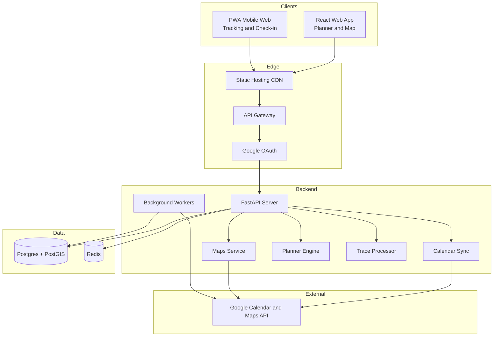
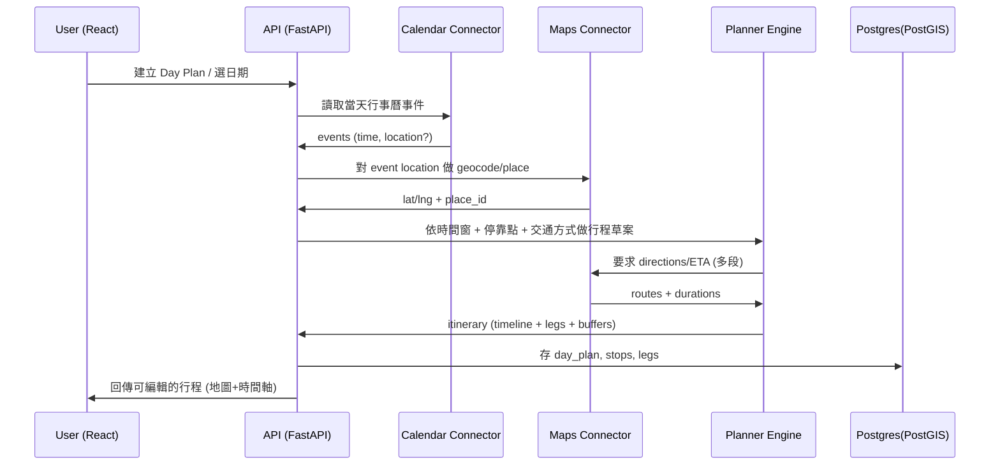
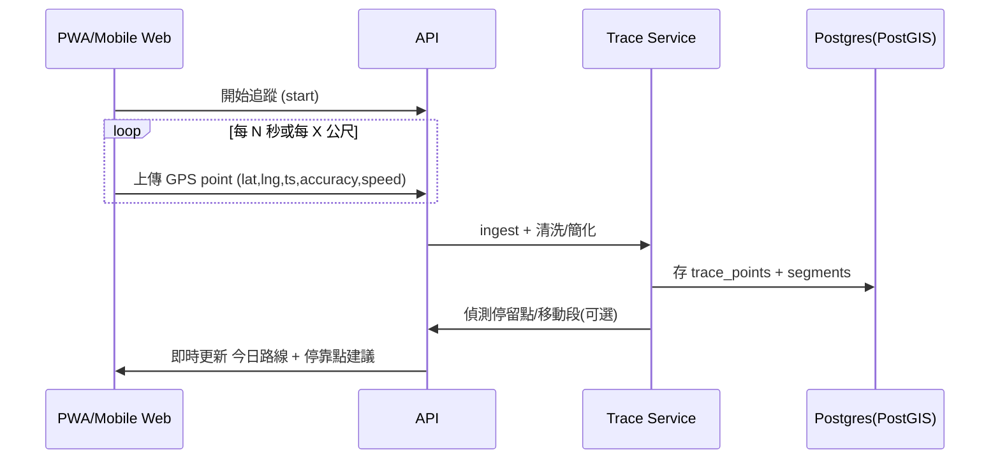

# Mimi Journey

旅行規劃與軌跡紀錄應用程式 - React UI + Python 後端架構

## 專案概述

Mimi Journey 是一個整合 **行事曆規劃**、**地圖路線**、**軌跡紀錄** 的旅行規劃工具，支援交通方式選擇、中途停靠點及休息點管理。

## 架構圖

## 核心資料流

### 1) 預先規劃 (Plan the day)

### 2) 當天軌跡紀錄 (Track the day)

## 技術架構

### 前端 (React)

| 模組 | 功能 |
|------|------|
| **Day Planner** | 時間軸 (Timeline)、行事曆事件列表、停靠點編輯（新增/拖曳排序/預留休息點） |
| **Map View** | 顯示 stops、路線、即時軌跡 polyline |
| **Transport Selector** | 行走/開車/大眾運輸/自行車 |
| **Recorder** | Start/Stop tracking、Quick check-in |

### 後端 (Python / FastAPI)

| 模組 | 功能 |
|------|------|
| **Auth** | Google OAuth 登入、Token refresh、scope 管理 |
| **Calendar Connector** | sync events（雙向：讀 + 寫回「行程」） |
| **Maps Connector** | Geocoding / Places / Directions、路線 ETA、距離矩陣 |
| **Planner Engine** | 整合「事件」+「停靠點」+「交通方式」+「時間限制」成 itinerary |
| **Trace Service** | 軌跡點清洗/簡化、偵測停留點、交通方式推測（可選） |

### 資料庫 (Postgres + PostGIS)

- `day_plan` / `stops` / `legs` / `constraints`
- `trace_points` / `trace_segments` (polyline)
- `place_cache` (place_id -> lat/lng/name)

## MVP 開發路線

1. **OAuth 登入 + 讀行事曆事件**
2. **事件地點 geocode + 地圖顯示 pins**
3. **手動新增停靠點 + directions 預覽**
4. **一鍵產生當天 itinerary（timeline + route legs）**
5. **前景追蹤：每 10s 上傳 GPS，畫出軌跡**
6. **自動偵測停留點 → 轉成「休息點候選」**

## 備註

- Web/PWA 在背景定位有限制；若需要更穩定的整天軌跡（螢幕關掉也能錄），需要原生 App（iOS/Android）
- 目前先以 React 做 MVP：**手動 check-in + 前景追蹤**，後續再升級
